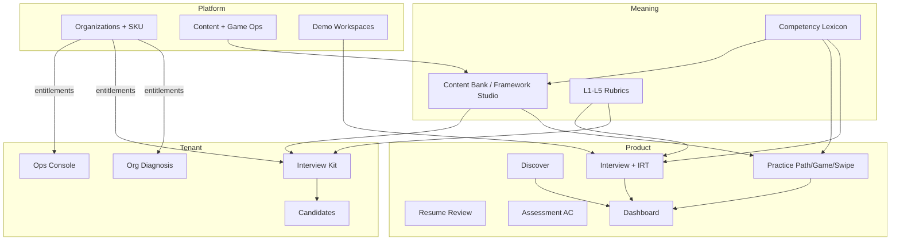

# AXHRD 솔루션 모듈 인벤토리

> 코드 기준 SSoT 정리 (2026-07-22).  
> 권한·내비·엔타이틀먼트 소스: `web/src/lib/platform/{capabilities,access,nav-registry}.ts`, `web/src/lib/auth/roles.ts`, `web/src/lib/org/entitlements.ts`, `web/prisma/schema.prisma`.

---

## 0. 한 장 요약

```
┌─────────────────────────────────────────────────────────────────┐
│  Platform Ops (HR_IN)     SUPERADMIN / BUSINESS / DEMO / CONTENT │
│  /admin/* · capability: platform.*                               │
├─────────────────────────────────────────────────────────────────┤
│  Tenant SaaS (기관)       Org ADMIN / STAFF (+ platform 겸직)    │
│  /org/* · capability: tenant.* · OrgProduct entitlement 게이트   │
├─────────────────────────────────────────────────────────────────┤
│  Product (개인)           MEMBER / STUDENT · PlanTier 사용량     │
│  /interview · /discover · /practice · /assessment · /dashboard   │
│  capability: product.*                                           │
└─────────────────────────────────────────────────────────────────┘
         Trust: page-guards · API require* · audit · feature flags
```

제품 여정(내비): **탐색 → 준비 → 실전**  
Growth: Discover → 자소서 첨삭 → 면접 → AC  
Practice: 5분 체험 → 학습 패스 → 역량게임 → 스와이프 카드

---

## 1. 권한 하이어라키

### 1.1 이중 축

| 축 | 필드 | 의미 |
|----|------|------|
| **플랫폼** | `User.platformRole` | HR_IN 내부 운영·영업·콘텐츠 |
| **기관** | `User.orgRole` + `organizationId` | 고객 테넌트 내 역할 |

해석 우선순위(`primaryPlatformRole`):  
`SUPERADMIN` → `BUSINESS_ADMIN` → `DEMO_ADMIN`/`ADMIN` → `CONTENT_ADMIN` → `ORG_ADMIN` → `ORG_STAFF` → `MEMBER`

### 1.2 PlatformRole

| 역할 | 라벨 | 범위 |
|------|------|------|
| `SUPERADMIN` | 수퍼어드민 | 전 capability · 설정 변경 · 역할 부여 |
| `BUSINESS_ADMIN` | 비즈니스 어드민 | 전 모듈 조회·체험 · 매뉴얼/시연 · **설정/권한 변경 불가** |
| `DEMO_ADMIN` | 데모 어드민 | 영업 Presenter · 데모 샌드박스 · 사용량 면제 |
| `ADMIN` | (레거시) | `DEMO_ADMIN`과 동일 |
| `CONTENT_ADMIN` | 콘텐츠 관리자 | CMS 운영 · 데모 체험 제외 |
| `NONE` | 일반 | 개인/기관 역할만 |

운영 세부 함수(`platform-ops.ts`):

| 함수 | SUPER | BUSINESS | DEMO | CONTENT |
|------|:----:|:--------:|:----:|:-------:|
| `canMutatePlatformSettings` | ✓ | | | |
| `canGrantPlatformRoles` | ✓ | | | |
| `canViewPlatformOrganizations` | ✓ | ✓ | | |
| `canViewDiagnosticConsole` | ✓ | ✓ | | |
| `canViewContentConsole` | ✓ | ✓ | | ✓ |
| `canViewPlatformSessions` | ✓ | ✓ | ✓ | |
| `canManageDemoWorkspaces` | ✓ | | ✓ | |
| `isInternalUsageExempt` | ✓ | ✓ | ✓ | |

### 1.3 OrgRole

| 역할 | 라벨 | 범위 |
|------|------|------|
| `ADMIN` | 기관 관리자 | 참여 현황 · 설정 · 킷 · 맞춤 역량 · 진단(엔타이틀먼트 시) |
| `STAFF` | 담당자 | 참여 현황 조회만 |
| `MEMBER` | 구성원 | 개인 제품 |
| `STUDENT` | (레거시=MEMBER) | 동일 |

코호트 집계 대상: `COHORT_MEMBER_ROLES = MEMBER | STUDENT`

### 1.4 Capability (모듈 단위 권한)

카테고리: `product` · `tenant` · `platform_content` · `platform_sales` · `platform_ops`

#### Product

| ID | 라벨 | 라우트 | 설계 의도 |
|----|------|--------|-----------|
| `product.dashboard` | 역량 트래킹 | `/dashboard` | IRT θ·백분위 스킬트리 |
| `product.discover` | 나를 발견하기 | `/discover` | 자기발견→면접 루프 |
| `product.interview` | 면접 | `/interview/setup` | 자소서 인용 · STAR · 꼬리질문 |
| `product.resume_review` | 자소서 첨삭 | `/resume-review` | JD 대사 → 부족 역량 연결 |
| `product.practice` | 역량 연습 | `/practice/path` | 패스·게임·스와이프 |
| `product.assessment` | 역량평가(AC) | `/assessment` | 서류함·역할연기 |
| `product.profile` | 프로필 | `/profile` | 계정·소속 |
| `product.demo_trial` | 5분 체험 | `/demo` | FREE 짧은 모의 |

#### Tenant

| ID | 라벨 | 라우트 | 게이트 |
|----|------|--------|--------|
| `tenant.cohort` | 참여 현황 | `/org/dashboard` | `interviewEnabled` |
| `tenant.settings` | 기관 설정 허브 | `/org/settings` | `saasPersonalizationEnabled` (ORG_ADMIN) |
| `tenant.interview_kit` | 인터뷰 킷 | `/org/settings/interview-kit` | 동일 |
| `tenant.custom_competency` | 맞춤 역량 | `/org/settings/competencies` | 동일 |
| `tenant.diagnostic` | 조직진단 | `/org/diagnosis` | `diagnosticEnabled` |

#### Platform

| ID | 라벨 | 라우트 |
|----|------|--------|
| `platform.organizations` | 기관 관리 | `/admin/organizations` |
| `platform.content` | 문항 뱅크 | `/admin/content` |
| `platform.diagnostic` | 조직진단 CMS | `/admin/diagnostic` |
| `platform.demo` | 고객 데모 | `/admin/demo` |
| `platform.users` | 사용자 권한 | `/admin/users` |
| `platform.sessions` | 면접 세션 | `/admin/sessions` |
| `platform.audit` | 감사 로그 | `/admin/audit` |
| `platform.subscriptions` | 구독 | `/admin/subscriptions` |
| `platform.permissions` | 권한 매트릭스 | `/admin/permissions` |
| `platform.benchmark` | 기관 비교 | `/admin/organizations/benchmark` |

### 1.5 역할 × Capability 매트릭스

| Capability | SUPER | BUSINESS | DEMO | CONTENT | ORG_ADMIN | ORG_STAFF | MEMBER |
|------------|:-----:|:--------:|:----:|:-------:|:---------:|:---------:|:------:|
| product.* (전부) | ✓ | ✓ | ✓ | ✓¹ | ✓² | ✓² | ✓² |
| tenant.cohort | ✓ | ✓ | ·³ | ·³ | ✓ | ✓ | |
| tenant.settings / kit / competency | ✓ | ✓ | ·³ | ·³ | ✓⁴ | | |
| tenant.diagnostic | ✓ | ✓ | | | ✓⁵ | | |
| platform.demo | ✓ | ✓ | ✓ | | | | |
| platform.content | ✓ | ✓ | | ✓ | | | |
| platform.diagnostic | ✓ | ✓ | | | | | |
| platform.organizations / sessions / benchmark | ✓ | ✓⁶ | ✓⁷ | | | | |
| platform.users / audit / subscriptions / permissions | ✓ | | | | | | |

¹ CONTENT: `product.demo_trial` 제외  
² MEMBER 계열: product만 (테넌트 없음)  
³ DEMO/CONTENT가 기관 ADMIN/STAFF를 **겸직**하면 cohort(+설정) 가산  
⁴ `tenantPersonalizationEnabled` 필요  
⁵ `diagnosticEnabled` 필요  
⁶ BUSINESS: organizations·sessions·benchmark (users/audit/subscriptions/permissions 제외)  
⁷ DEMO: sessions만 (+ demo)

가드: `requireCapability` / `requireProductCapability` (`page-guards.ts`).  
내비: `buildNavigationForUser`가 capability + entitlement로 필터.

### 1.6 Org Product Entitlement (SKU)

기관을 쪼개지 않고 **플래그로 SKU** 제어.

| Key | DB 필드 | 라벨 | 테넌트 메뉴 |
|-----|---------|------|-------------|
| `interview` | `interviewEnabled` | 면접 | 참여 현황 · 면접 기록 |
| `competency` | `saasPersonalizationEnabled` | 역량평가 | 인터뷰 킷 · 맞춤 역량 · 지원자 결과 |
| `diagnostic` | `diagnosticEnabled` | 조직진단 | ARC Index 웨이브 |
| `assessment` | `assessmentEnabled` | AC 과제 | 과제 배포 |

OrgKind 기본 프리셋:

| OrgKind | interview | competency | diagnostic | assessment |
|---------|:---------:|:----------:|:----------:|:----------:|
| `CAREER_CENTER` | ✓ | | | |
| `HR_ENTERPRISE` | ✓ | ✓ | | |

기관 상태: `OrgStatus` (PENDING 승인 등). 생성은 `/org/setup` → 플랫폼 승인.

### 1.7 기관 내비 (saas-nav)

| 조건 | 링크 |
|------|------|
| `tenant.cohort` | `/org/dashboard` 참여 현황 |
| `tenant.interview_kit` ∧ competency | `/org/candidates` 지원자 결과 |
| `tenant.diagnostic` ∧ diagnostic | `/org/diagnosis` |
| settings ∨ kit ∧ (competency∨interview∨assessment) | `/org/settings` |

코드상 people/members는 대시보드 탭·별도 라우트로 노출 (`/org/people`, `/org/members`).

### 1.8 빌링 · 사용량

| PlanTier | 모의면접/월 | 자기발견/월 | 드릴/주 | 비고 |
|----------|------------:|------------:|--------:|------|
| FREE | 1 | 1 | 3 | 기본 |
| INDIVIDUAL_PRO | 4 | 1 | ∞ | 9,900원 |
| INDIVIDUAL_PREMIUM | ∞ | ∞ | ∞ | 24,900원 |
| ORG_STANDARD | ∞ | ∞ | ∞ | 좌석 9,900 · 멤버캡 50 |
| ORG_ENTERPRISE | ∞ | ∞ | ∞ | 계약 |

면제: SUPER / BUSINESS / DEMO.  
UsageKind: `mock_interview` · `self_discovery` · `daily_drill`.

### 1.9 Feature Flags (플랫폼 전역)

| Key | 라벨 | 기본 |
|-----|------|------|
| `resume_claim_verification` | 자소서 진위 검증 | on |
| `jd_bonus_question` | JD 보너스 질문 | on |
| `triple_feedback_mode` | 트리플 피드백 | on |

관리: `/admin/settings/features`.

### 1.10 역량게임 런타임 스위치

`CompetencyGameRuntimeConfig` (singleton `default`):  
`disabledGameTypes` · `disabledLevelIds` → `getEnabledGameCourse`.  
관리 UI: `/admin/content/game`.

---

## 2. Product 모듈 (개인)

### 2.1 대시보드 — `product.dashboard`

| 항목 | 내용 |
|------|------|
| 라우트 | `/dashboard`, `/dashboard/activity` |
| 기능 | IRT θ·역량 백분위·세션 이력·활동 로그 |
| 권한 | 로그인 + product.dashboard |

### 2.2 나를 발견하기 — `product.discover`

| 항목 | 내용 |
|------|------|
| 라우트 | `/discover`, `/discover/[sessionId]`, `.../report` |
| API | `/api/discover/start`, `respond` |
| 기능 | 비채점 서사 인터뷰 → 강점/가치 프로필 (`SelfDiscovery*`) |
| 한도 | `self_discovery` 월간 |

### 2.3 자소서 첨삭 — `product.resume_review`

| 항목 | 내용 |
|------|------|
| 라우트 | `/resume-review` |
| 기능 | JD/프리셋 대사 · 부족 역량 리포트 → 모의면접 연결 |
| 관리 | `/admin/content/resume-review` 기준 CMS |
| 플래그 | 면접 연계 시 claim verification |

### 2.4 모의면접 — `product.interview`

| 항목 | 내용 |
|------|------|
| 라우트 | `/interview/setup` → `/interview/[sessionId]` → report · plan 피드백 |
| API | `start` · `respond` · `tts` · `real-questions` · JD analyze/fetch/parse |
| 기능 | 적응형 문항 · 자소서 근거 인용 · 세션당 꼬리질문 · STAR 채점 · IRT θ |
| 플래그 | JD 보너스 · 트리플 피드백 · 자소서 진위 |
| 한도 | `mock_interview` 월간 |
| Meaning | NCS Competency · Rubric L1–L5 · Evidence |

### 2.5 역량 연습 — `product.practice`

#### 학습 패스 `/practice/path`

- 역량별 지식·원리 → 드릴 → 실전 연결
- API: `/api/learning/path`, `daily`, `drill`
- 단어장: lexicon `vocabTerms` / NCS 앵커

#### 역량게임 `/practice/game`

- 듀오링고식 **선형 해금** (자유 선택 없음)
- 게임 타입: `choice`(SJT) · `intent_read` · `best_worst` · `true_false` · `swipe_judge` · `fill_blank` · `order` · `match_pairs` · `spot_weak` · `chip_build` · `speak_along`
- 난이도 1–5 → IRT b 시드 · 레벨 내 적응형 추출 · 로컬 2PL EAP
- 조직 렌즈 SJT (LARGE/PUBLIC/STARTUP)
- 런타임 킬스위치 반영

#### 스와이프 카드 `/practice/swipe`

- 틴더식 질문 카드 드릴

한도: `daily_drill` 주간 (FREE 3회).

### 2.6 역량평가(AC) — `product.assessment`

| 항목 | 내용 |
|------|------|
| 라우트 | `/assessment`, `/assessment/attempt/[id]`, `.../report` |
| API | `/api/assessment/scenarios`, `attempts` |
| 기능 | In-Basket · Role-Play → 증거형 행동 리포트 |
| 기관 배포 | entitlement `assessment` + `/org/settings/assessment` |

### 2.7 5분 체험 — `product.demo_trial`

| 항목 | 내용 |
|------|------|
| 라우트 | `/demo`, `/demo/[slug]` |
| 기능 | 데모 키트 기반 짧은 모의 · 게스트/FREE 진입 |
| 비고 | CONTENT_ADMIN 매트릭스에서 제외 |

### 2.8 프로필 — `product.profile`

| 항목 | 내용 |
|------|------|
| 라우트 | `/profile` |
| 기능 | 계정 · 소속 가입/탈퇴 · 선호 |

### 2.9 기타 개인 표면

| 라우트 | 기능 |
|--------|------|
| `/pricing`, `/billing/*` | 플랜·토스 결제 |
| `/diagnosis`, `/diagnosis/w/...` | 공개 진단 응답 링크 (웨이브·팀 슬러그) |
| `/kit/[slug]` | 공개 인터뷰 킷 공유 링크 |
| `/certificate` (해당 시) | 역량 인증서 공유 (Premium 피처) |

---

## 3. Tenant 모듈 (기관 SaaS)

컴포넌트 폴더: `web/src/components/org/{ops,people,access,activity,kit,shared}`

### 3.1 운영 콘솔 — `tenant.cohort`

| 라우트 | 기능 |
|--------|------|
| `/org/dashboard` | 통합 운영 콘솔 (탭: 현황·멤버·피플 등) |
| `/org/dashboard/cohort` | 코호트 집계 (완료율·역량 평균, **개인 원문 비공개**) |
| `/org/dashboard/activity` | 기관 활동 로그 |
| `/org/dashboard/members/[userId]` | 멤버 상세 |
| `/org/people`, `/org/people/[userId]` | People 대시보드 · 동의 기반 열람/마스킹 |
| `/org/members` | 멤버 목록·역할 |

권한: ORG_ADMIN · ORG_STAFF (+ 겸직 플랫폼).  
API: `/api/org/cohort`, `people`, `members`, `directory`, …

### 3.2 접근·초대 — access

| 라우트/기능 | 내용 |
|-------------|------|
| 가입 코드 | 생성·재발급 (`RegenerateCodeButton`) |
| `/org/invite/[token]` | 초대 수락 |
| 멤버십 요청 심사 | `MembershipReviewModal` |
| 탈퇴 | `LeaveOrgButton` |
| API | `invitations`, `join`, `leave`, `membership-requests`, `membership-settings` |

역할 부여: 기관 ADMIN이 STAFF/MEMBER 조정 (플랫폼 SUPER는 `/admin/users`).

### 3.3 인터뷰 킷 — `tenant.interview_kit`

| 라우트 | 기능 |
|--------|------|
| `/org/settings/interview-kit` | 킷 빌더·워크스페이스 |
| (레거시) `/org/saas/settings/interview-kit` | 동일 계열 |
| 공유 | `KitShareManager` · 공개 `/kit/[slug]` |
| API | `/api/org/interview-kit`, `/api/kit/[slug]` |

전제: competency entitlement.

### 3.4 맞춤 역량 — `tenant.custom_competency`

| 라우트 | 기능 |
|--------|------|
| `/org/settings/competencies` | 기본 역량 포크 · ORG 소유 역량 |
| `.../competencies/[id]/questions` | 문항 편집 |
| 승격 | PLATFORM 승격은 SUPERADMIN |

### 3.5 설정 허브 — `tenant.settings`

| 라우트 | 기능 |
|--------|------|
| `/org/settings` | 킷·개인화·AC 배포 허브 |
| `/org/settings/assessment` | AC 시나리오 배포 (`AssessmentShareManager`) |
| `/org/setup` | 기관 생성 신청 |

### 3.6 지원자·후보자

| 라우트 | 기능 |
|--------|------|
| `/org/candidates` | 공유 킷 결과 목록 |
| `/org/candidates/[shareId]` | 공유별 지원자 |
| `.../compare` | 비교 뷰 |
| `/org/candidates/session/[sessionId]` | 세션 상세 |
| `/org/assessment/attempts/[attemptId]` | AC 시도 열람 |

게이트: competency (및 assessment 배포 시 assessment).

### 3.7 조직진단 — `tenant.diagnostic`

| 라우트 | 기능 |
|--------|------|
| `/org/diagnosis` | 웨이브 목록 |
| `/org/diagnosis/waves/[waveId]` | 웨이브·팀·응답 링크 |
| 공개 응답 | `/diagnosis/w/[waveSlug]/t/[teamSlug]` |
| API | `/api/org/diagnosis`, `/api/diagnosis/*` |

의미층: ARC Index · `DiagnosticSubscale` · Gap-to-Hire 신호.

### 3.8 기관 피드백

- `OrgMemberFeedback` / `MemberFeedbackInbox`
- API: `/api/org/my-feedback`

---

## 4. Platform 모듈 (어드민)

내비 섹션: **tenants → product → operations → settings**

### 4.1 기관 — `platform.organizations`

| 라우트 | 기능 |
|--------|------|
| `/admin/organizations` | 승인·목록·entitlement 토글 |
| `/admin/organizations/[id]` | 상세 허브 |
| `.../cohort`, `interview-kit`, `waves` | 기관 대리 조회 |
| `/admin/organizations/benchmark` | 테넌트 간 지표 (`platform.benchmark`) |
| `/admin/saas` | SaaS 허브 (킷 등) |

쓰기(승인·SKU): SUPER만 (`canMutatePlatformSettings`).

### 4.2 콘텐츠 CMS — `platform.content`

| 라우트 | 기능 |
|--------|------|
| `/admin/content` | Framework Studio · NCS · 글로벌 역량 · **역량사전** 탭 |
| `/admin/content/game` | 역량게임 타입/레벨 킬스위치 |
| `/admin/content/assessment` | AC 시나리오 CMS |
| `/admin/content/resume-review` | 첨삭 기준 |
| `/admin/repository` | 레포지토리 뷰 |
| API | competencies · questions · rubrics · content-bank · lexicon · learning · ontology · meaning · competency-game |

역량사전 SSoT: `competency-lexicon.json` (37역량 · 5클러스터 · L1–L5).  
동기화: `POST /api/admin/competency-lexicon/sync-to-bank`.

쓰기: SUPER · CONTENT_ADMIN. 조회: + BUSINESS.

### 4.3 조직진단 CMS — `platform.diagnostic`

| 라우트 | 기능 |
|--------|------|
| `/admin/diagnostic` | 문항뱅크·전 기관 웨이브 허브 |
| `/admin/diagnostic/waves/[id]` · report | 웨이브 상세·리포트 |

### 4.4 데모 — `platform.demo`

| 라우트 | 기능 |
|--------|------|
| `/admin/demo`, `/admin/demo/[id]` | 영업 샌드박스 (역량·질문·루브릭 격리) |
| 편집 | SUPER · DEMO_ADMIN |

### 4.5 운영

| 라우트 | Capability | 기능 |
|--------|------------|------|
| `/admin/users` | users | 플랫폼·기관 역할 부여 |
| `/admin/sessions` | sessions | 면접 로그·응답 원문 |
| `/admin/data-storage` | sessions | 데이터 보관 |
| `/admin/audit` | audit | CMS 변경·롤백 |
| `/admin/irt-recalibration` | (ops) | IRT 재보정 |
| `/admin/assessment` | content 계열 | AC 운영 |

### 4.6 설정

| 라우트 | Capability | 기능 |
|--------|------------|------|
| `/admin/subscriptions` | subscriptions | 플랜·결제 |
| `/admin/permissions` | permissions | 역할×모듈 매트릭스 UI |
| `/admin/settings/features` | (SUPER) | Feature flags |

---

## 5. Meaning · Intelligence · Trust (횡단)

레이어 상세: `docs/AX-PLATFORM-LAYERS.md`

| 층 | 모듈 연결 |
|----|-----------|
| **L3 Meaning** | CompetencyCluster · Competency(NCS∥Global) · RubricLevel · Question · Evidence · ProfileSignal · DiagnosticSubscale · lexicon |
| **L4 Intelligence** | Gemini/DeepSeek 채점·피드백 · IRT 엔진(결정론) · mock 폴백 |
| **Trust** | capability 가드 · entitlement · audit · PII/동의 마스킹 · feature flags · 게임 런타임 스위치 |

맵 규칙: IRT NCS 풀과 Global 20은 **합치지 않고** `MAPS_TO`로만 연결.

---

## 6. 모듈 의존 다이어그램



---

## 7. 소스 앵커 (빠른 점프)

| 주제 | 경로 |
|------|------|
| Capability 레지스트리 | `web/src/lib/platform/capabilities.ts` |
| 권한 resolve | `web/src/lib/platform/access.ts` |
| 내비 | `web/src/lib/platform/nav-registry.ts` |
| 페이지 가드 | `web/src/lib/platform/page-guards.ts` |
| 역할 헬퍼 | `web/src/lib/auth/roles.ts`, `platform-ops.ts` |
| Org SKU | `web/src/lib/org/entitlements.ts`, `saas-nav.ts` |
| 플랜·사용량 | `web/src/lib/billing/plans.ts`, `usage.ts` |
| Feature flags | `web/src/lib/platform/feature-flags.ts` |
| 역량게임 | `web/src/lib/competency-game/**` |
| 역량사전 | `web/src/data/competency/competency-lexicon.json` |
| Org UI | `web/src/components/org/**` |
| 스키마 | `web/prisma/schema.prisma` |

---

## 8. 문서 유지 규칙

1. 새 화면은 **capability ID**를 먼저 등록한 뒤 라우트·내비에 연결한다.
2. 기관 기능은 **entitlement 키** 없이 라우트만 추가하지 않는다.
3. 이 문서는 코드와 어긋나면 **코드를 진실**로 보고 문서를 고친다.
4. 레이어 철학 변경은 `AX-PLATFORM-LAYERS.md`, 상업/로드맵은 `COMMERCIAL.md` / `ROADMAP.md`.
